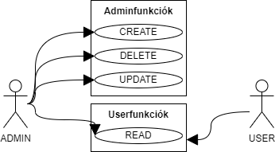
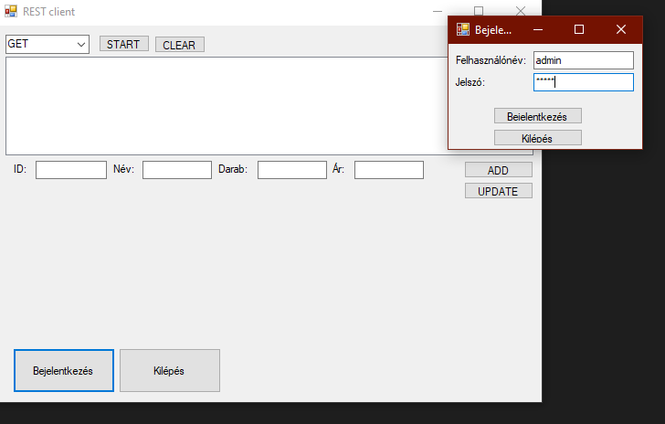
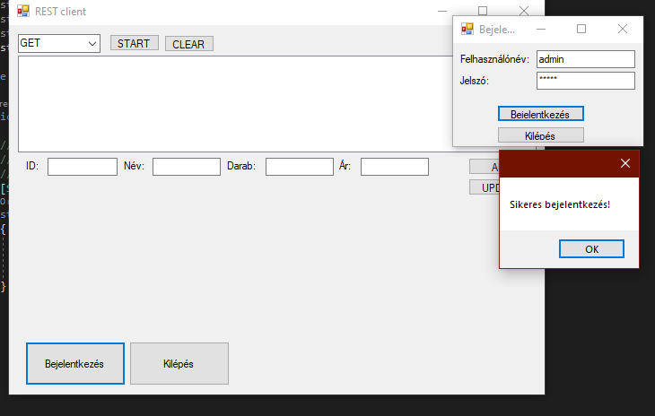
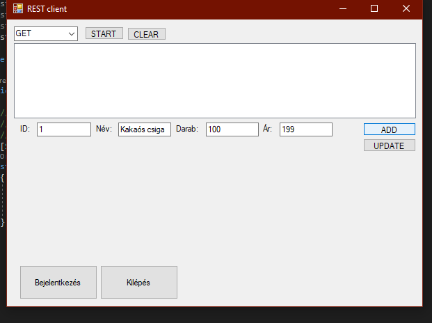

# Funkcionális specifikáció 

## Áttekintés
A következőkben egy olyan rendszer fejlesztésén fogunk dolgozni, mely az ASD Kft. munkáját könnyíti meg. Célunk ezzel a projekttel a régi és elavult raktározási programjuk kiváltása. A dolgozók elérhetik a főraktár készleteit és akár egyidőben is módosíthatják azt egy REST API alkalmazás segítségével. Nem tervezünk több platformon való megjelenést, mivel nem tartjuk szükségesnek egyéb eszközön (tab, telefon) ennek a programnak az elérésrét, mert a cég csupán PC-ket biztosít a rendeléshez.
A következőkben egy olyan rendszer fejlesztésén fogunk dolgozni, mely az ASD Kft. munkáját könnyíti meg. Célunk ezzel a projekttel a régi és elavult raktározási programjuk kiváltása, melynek felülete bonyolult és amihez már nem érhető el támogatás a fejlesztő részéről, ezért használata kockázatos a cég számára.

## Jelenlegi helyzet
Az ASD Kft. szeretné könyebbé és átláthatóbbá tenni dolgozói számára a főraktár készleteinek lekérdezését, rendelés esetén pedig módosítását. A jelenlegi szofverük elavult és lassú, időt szeretnének megspólni.
Új típusú hardvereken nehéz működtetni a szoftvert, mely lassú és működése nem túl megbízható ezáltal. Továbbá a cég számítógépeinek teljesítménye sincs ezáltal kihasználva.

## Követelménylista
|MODUL|ID|NÉV|V.|LEÍRÁS|
|---|---|---|---|---|
|Adatbázis|K1|Adatbázis|1.0|A program újraindítása során az adatok nem vesznek el.|
|Szerver|K2|Adatbázis kapcsolat|1.0|Adatbázis összekapcsolása a szerverrel.|
|Szerver|K3|CRUD|1.0|CRUD műveletek megvalósítása a szerver részéről.|
|Szerver|K4|SWAGGER|1.0|Interaktív dokumentáció.|
|Kliens|K5|C# kliens kialakítása|1.0|A program felületének megtervezése UX szempontból. |
|Kliens|K6|C# kliens megvalósítása|1.0|A főképernyő megvalósítása. |
|Kliens|K7|C# kliens megvalósítása|1.0|A menük megvalósítása. |
|Kliens|K8|C# kliens megvalósítása|1.0|A bejelentkezés felület megvalósítása. |
|Jogosultság|K9|Jogosultság rendszer|1.0|Jogosultság rendszer a CREATE, UPDATE, DELETE funkciókhoz.|
|Jogosultság|K10|Jogosultság rendszer|1.0|Jogosultság rendszer a READ funkcióhoz.|

## Jelenlegi üzleti folyamatok modellje
Jelenleg egy elavult szoftver van használatban, mely lassú. Felülete bonyolult és nehezen betanítható a használata nem csak az idősebb, de még a fiatalabb kollégáknak is.\
A bonyolult felület és a szoftver lassúsága mellett fontos azt is megemlíteni, hogy a cég frissítéseket sem kap többé, ami biztonsági kockázatokhoz is vezethet hosszútávon. Továbbá körülményes a szoftver futattása újabb harvereken, melyeknél nagyon sok támogatási hiba jött elő.\
Fenntartása ár-érték arányban nem éri meg többé nekünk.

## Igényelt üzleti folyamatok modellje
Az előzőekben leírt folyamatokat szeretnék optimalizálni. Korszerű szoftvert szeretnének. Manapság a raktározás nem kellene, hogy lassú folyamat legyen. Egy valós időben változásokat kötni tudó rendszer a cél, melynek használata könnyen betanulható. Gyors és innovatív megoldás legyen, mely megkönnyíti, mind dolgozóik, mind a vezetőség munkáját. Ezt egy Rest Api alkalmazással fogjuk megvalósítani.  
A könnyebb átláthatóság és a szoftver egyszerűsége, kezelésének könnyű megtanulhatósága minőségbeli változásokat is hozhat a cég életébe, hiszen csökkennek az adminisztrációs hibalehetőségek, illetve a folyamatos frissítésekkel biztonsíthatjuk a cég számára azt, hogy a szoftvertermék átadása után ne következhessen be végzetes hiba.  
Tehát a előbbiekből levonható a következtetés, hogy a legfontosabb az igényelt folyamatok közül, az a hosszú távú támogatás és karbantartás.

## Használati esetek  
  
ADMIN: A program használatakor Ő képes módosítani illetve törölni az adatbázis tartalmát. Bejelentkezés szükséges és ezek után lesznek elérhetők ezek a funkciók.  
FELHASZLÓ: A program használatakor lekérdezni képes. Az összes termék vagy pedig az id alapján tud listázni, így megtekinteni, mi van aktuálisan a raktárban.  
  
**FELHASZNÁLÓ**  
1.: A "START" gomb lenyomásável kilistázza a raktár aktuális tartalmát
  
2.: A "Bejelentkezés" gombra kattintva megnyílik a bejelentkezőfelületünk, ahová a megfelelő felhasználónév és jelszó megadásával elérhetővé válnak az admin funkciók, mint az új tétel felvétele ("ADD"), tételk(ek) törlése, illetve a meglévő tétel adatainak módosítása ("UPDATE").

3.: *Képernyő törlése:* Ezt a funkciót az admin, illetve a userek is használhatják. Akkor használjuk, ha már sok mindent csináltunk és átláthatatlan a munkafelületünk. Ekkor a "CLEAR" gombra kattintva minden eddigi kiírás eltűnik, de a tételek természetesen az adatbázisban maradnak, hiszen törölni csak az admin tud. 
Tétel törlése: Csak az admin használhatja ezt a funkciót. A tétel ID-ja megadása után a tétel törlésre fog kerülni az adatbázisból. Erre akkor lehet szükség, ha már egy adott terméket nem forgalmaz tovább a cég.  
  
**ADMIN**  
1.:*Tétel adatainak módosítása:* Ha az admin elrontott valamilyen adatot a felvételkor, szerencsére nincs szükség arra, hogy kitörölje a tételt és újra felvegye, elég csak frissíteni az adatokat. Ez a funkció abban az esetben is használható, ha például változott a tétel ára, vagy már más mennyiség érhető el a raktában belőle. Ekkor az ID mezőbe beírjuk a tétel azonosítóját, a megváltoztatni kívánt adat mezőjébe pedig a már frissített adatot írjuk be, a többi tulajdonságot változatlanul hagyjuk. Az "UPDATE" gombra kattintva frissítésre kerülnek az adatok.  
  
2.:*Lekérdezés lefuttatása:* Erre akkor lehet szükség, ha valamilyen információt szeretnénk megtudni az adott tételről (általában ez az ár, vagy az elérhető mennyiség). Ezt a funkciót az admin, illetve a userek is használhatják. Az ablak bal felső részében egy legördülő listából választhatjuk ki, hogy ID szerint szeretnénk valamit konkrétan lekérdezni, vagy az összes tételt szeretnénk kilistázni. A kért adat megadása után a "START" gombra kattintva megkapjuk a kért információt.

## Képernyőtervek  
  
  

## Forgatókönyv
Ideális esetben az ASD Kft. dolgozói képesek valós időben nyomon követni a raktár tartalmát. Adminisztrátori joggal akár módosítás és törlés is eszközölhető.

## Fogalomszótár
**PC**: personal computer (személyi számítógép)  
**CRUD**: CREATE, READ, UPDATE és DELETE műveletek összefogó neve  
**UX**: User Experience  
**Admin**: az a regisztrált felhasználó, aki a megfelelő felhasználónévvel, illetve jelszóval bejelentkezve hozzáférhet magasabb szintű funkciókhoz  
**Adminfunkciók**: az admin számára elérhető egyedi funkciók: új tétel felvétele az adatbázisba, tétel törlése, tétel adatainak módosítása  
**Felhasználó (user)**: az a személy, akinek nincs regisztrációja, így csak a lekérdező alap funkciókhoz fér hozzá, jellemzően ilyen user esetünkben az az általános dolgozó, aki használja  rendszerünket  
**Felhasználónév**: az admin által bejelentkezéskor használt azonosító, ami megkülönbözteti őt a usertől, illetve ezáltal hozzáférhet több funkcióhoz is  
**Jelszó**: egy egyedi biztonsági kód, mely biztosítja, hogy csak az arra jogosult szemályek léphessenek be az adminisztrációs felületre  
**ID**: az adatbázisba került termék egyedi azonosítója, mely alapján lehet keresni, illetve lehet rá hovatkozni  
**Név**: az adatbázisba került termék neve, ezalapján is lehet rá hivatkozni, de nem ajánlott, mivel ez nem egyedi  
**Ár**: az adott tétel pénzben kifejezett értéke (esetünkben magyar forint)
