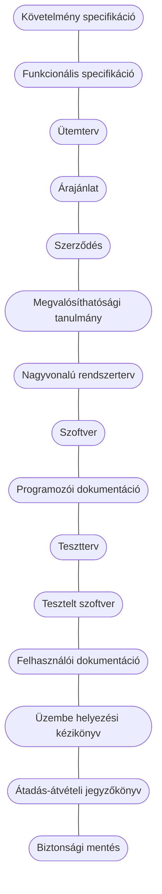

# Az életciklus dokumentumai

## Követelmény specifikáció
A követelményspecifikáció alapja a megrendelővel készített riportok.

**Részei:**
- Jelenlegi helyzet leírása
- Vágyálomrendszer leírása
- A rendszerre vonatkozó pályázat, törvények, rendeletek, szabványok és ajánlások felsorolása
- Jelenlegi üzleti folyamatok modellje
- Igényelt üzleti folyamatok modellje
- Követelménylista (Csak ez a kötelező)
- Irányított és szabad szöveges riportok szövege
- Fogalomszótár
*Nem funkcionális követelmények:*
- Helyesség
- Használhatóság
- Megbízhatóság
- Adaptálhatóság / hordozhatóság
- Karbantarthatóság
- Hatékonyság / magas teljesítmény
- Bővíthetőség / flexibilitás
- Újrahasznosíthatóság
- Kompatibilitás
- Könnyen megvásárolható vagy letölthető

## Funkcionális specifikáció 
A felhasználó szemszögéből írja le a rendszert. A követelményelemzésből ismerjük az elkészítendő rendszer üzleti folyamatait. Ezeket kell átalakítanunk funkciókká, azaz menükké, gombokká, lenyíló listákká. A funkcionális specifikáció központi eleme a használati esetek (use case). Ezek olyan egyszerű ábrák, amelyet a megrendelő könnyen megért mindenféle informatikai előképzettség nélkül. A követelményspecifikációhoz képest sok ismétlődő fejezet van. Ezeket nem fontos átemelni, elég csak hivatkozni rájuk. Az egyes módszertanok eltérnek abban, hogy mely fejezeteket és milyen mélységben kell elkészíteni. Általában elmondható, hogy a modern módszertanok használatieset-központúak. A funkcionális specifikáció fontos része az úgynevezett megfeleltetés (traceability), ami megmutatja, hogy a követelményspecifikációban felsorolt minden követelményhez van-e azt kielégítő funkció. A megrendelőnek küldjük el a kész specifikációt. Érdemes néhány megbeszélésen bemutatni a képernyőterveket, a forgatókönyveket. Minden megbeszélésről készítsünk jegyzőkönyvet. Ha a funkcionális specifikációt elfogadta a megrendelő, akkor következik az árajánlat kialakítása.

**Részei:**
- Jelenlegi helyzet leírása
- Vágyálomrendszer leírása
- A rendszerre vonatkozó pályázat, törvények, rendeletek, szabványok és ajánlások felsorolása
- Jelenlegi üzleti folyamatok modellje
- Igényelt üzleti folyamatok modellje
- Követelménylista
- Használati esetek
- Képernyő tervek
- Forgatókönyvek
- Követelmény megfeleltetés
- Fogalomszótár

## Ütemterv
Az árajánlat legfontosabb része az ütemterv. Az ütemterv határozza meg, hogy mely funkciók kerülnek be a rendszer következő verziójába és melyek maradnak ki. Egy példa ütemterv a mellékletben található.

## Árajánlat
Az árajánlat kialakításához legalább két dolgot kell tudnunk, hány napig fog tartani a fejlesztés, illetve hány ember fog rajta dolgozni és mekkora a napidíjunk. 
Az első adat az ütemtervből kiolvasható. A második adatot általában úgy számoljuk ki, hogy 50%-os kihasználtság mellett legyen a cégünk nullszaldós.

## Megvalósítási tanulmány
A projekt megvalósíthatósági tanulmánya általában egy 10-50 oldalas dokumentum a projekt nagyságától függően. A megvalósíthatósági tanulmány célja, hogy megfelelő információkkal lássa el a döntéshozókat a projekt indításával, finanszírozásával kapcsolatban.

## Nagyvonalú rendszertterv
A rendszerterv egy írásban rögzített specifikáció, amely leírja mit (rendszer), miért (rendszer célja), hogyan (terv), mikor (időpont), és miből (erőforrások) akarunk a jövőben létrehozni.\ 
Fontos, hogy reális legyen, azaz megvalósítható lépéseket írjon elő. A rendszerterv hasonló szerepet játszik a szoftverfejlesztésben, mint a tervrajz az építkezéseken, tehát elég részletesnek kell lennie, hogy ebből a programozók képesek legyenek megvalósítani a szoftvert.

**Fajtái:**
- konceptuális (mit, miért)
- nagyvonalú (mit, miért, hogyan, miből)
- részletes (mit, miért, hogyan, miből, mikor)

