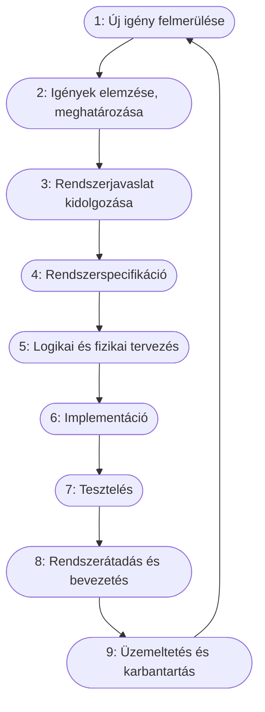

# A szoftver életciklusa

**Az életciklus (Software Development Life Cycle – SDLC):** A szoftverrel egyidős fogalom, életének állomásait írja le az igény megszületésétől az átadásig. Tipikus, hogy a felhasználók előbb vagy utóbb felmerülő új ötletei a szoftver továbbfejlesztését teszik szükségessé. Tehát egy szoftver soha sincs kész, ciklikusan megújul.

Az életciklus lépéseit a módszertanok határozzák meg. Ezeknek célja, hogy magas színvonalú szoftvert fejlesszünk minél kisebb költséggel.

## A szoftverfejlesztés átlagos élettciklusa

- **1. Új igény felmerülése:** A felhasználókban új igény merül fel.

- **2. Igények elemzése, meghatározása:** Az igények, követelmények elemzése, meghatározása, amit követelményspecifikáció foglal magába.

- **3. Rendszerjavaslat kidolgozása:** Ez a funkcionális specifikáció, ütemterv, szerződéskötés megvalósításából áll.

- **4. Rendszerspecifikáció:** Megvalósíthatósági tanulmány és nagyvonalú rendszerterv.

- **5. Logikai és fizikai tervezés:** Ezekhez a logikai és fizikai rendszertter tartozik.

- **6. Implementáció:** Maga a szoftver.

- **7. Tesztelés:** Tesztterv, tesztesetek, teszt napló írása és a validált szoftver tartozik ide.

- **8. Rendszerátadás és bevezetés:** Felhasználói dokumentáció.

- **9. Üzemeltetés és karbantartás:** Rendszeres mentés.

- **10. Új igény felmerülése:** A felhasználókban új igény merül fel.

Látható, hogy az első lépés és az utolsó ugyanaz. Ez biztosítja a ciklikusságat. Elvileg egy hasznos szoftvernek végtelen az életciklusa. Gyakorlatban a szoftver és futási környezete elöregszik, már nem lesz programozó, aki ismerné a programozási nyelvet, amin íródott (ilyen probléma van manapság a COBOL programokkal), a futtató operációs rendszerhez nincsenek frissítések, a meghibásodott hardverelemeket nem lehet pótolni. Az ilyen IT rendszereket hívjuk „legacy system”- nek (kiöregedett, hagyaték rendszernek). Valahol itt van vége az életciklusnak.
Érdemes megfigyelni, hogy két lépésnek, a Rendszerspecifikációnak és a Logikai és fizikai tervezésnek, ugyanaz az angol neve: „Analysis & Design”. Ez ezért van így, mert az első lépésben inkább az analízisen, a következőben inkább a tervezésen van a hangsúly, de mind a kettőben van ez is, az is. Ezért ezt egy lépésnek tekintik az angol szakirodalomban.
